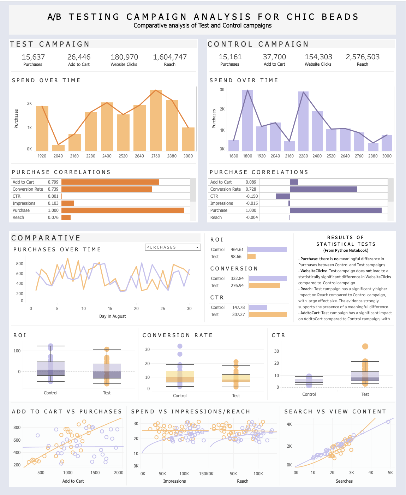

# A/B Testing for E-Commerce Fashion Brand
To practice skills in A/B testing, I utilized a dataset designed for this purpose and created a fictional backstory for the company I will analyze.
### ChicBeads
ChicBeads, a sister store to a popular online fashion retailer known for its trendy and affordable clothing, specializes in creating colorful beaded jewelry that complements many of the outfits sold at its sister store. Each accessory is sold for $5.00 (USD). The company has been performing well but decided to optimize its advertising strategies to boost online sales. To achieve this, they launched an A/B testing campaign to identify the most effective ways to reach and convert their target audience.
#### Campaign Details:
- **Control Campaign:** The control campaign focused on traditional display ads featuring static images of their latest clothing collection.
- **Test Campaign:** The test campaign experimented with video ads showcasing short fashion shows and styling tips from influencers.
  
**Hypothesis:** The Test Campaign will lead to a higher number of purchases compared to the Control Campaign due to different marketing strategies.

    

Interactive Tableau dashboard can be found [here](https://public.tableau.com/app/profile/johanna.schmidle/viz/ChicBeadsAB-TestingDash/Dashboard1)

## Motivation
**Goal:** Increase the number of purchases through the Test Campaign compared to the Control Campaign.  
**Primary Objective:** Determine if there is a significant difference in the number of purchases between different campaigns.  
**Secondary Objectives:** Assess the impact of the campaigns on other metrics such as Website Clicks, Reach, and Add to Cart.  

## Task List
1. Clean Data (_Cleaned table:_ [CatCouchReviewTable.csv](https://github.com/johannaschmidle/Amazon-Cat-Couch/blob/main/CatCouchReviewTable.csv))
2. Visualize Data ([ab-testing-project.ipynb](https://github.com/johannaschmidle/ABTesting-FashionCampaign/blob/main/ab-testing-project.ipynb))
3. Statistical Tests + Hypothesis Testing (same file as above)
   - (Mann-Whitney U Test/ Two-Sample T-Test, Pairwise Tests) 
4. Create Dashboard ([Tableau Dashboard](https://public.tableau.com/app/profile/johanna.schmidle/viz/ChicBeadsAB-TestingDash/Dashboard1))
   
## Metrics and Dimensions
- Number of purchases
- AddtoCart
- WebsiteClicks
- Reach
- Cost Per Acquisition (CPA)
- Return on Investment (ROI)
- Click-Through Rate (CTR)
- Conversion Rate

## Summary of Findings
#### From Visualizations
- The control campaign reaches a broader audience, but that does not result in more people adding to cart. The test campaign seems to be more focused, resulting in a stronger correlation between Add to Cart and Purchase.
- The advertisement seems to match what customers are searching for (this is inferred from the strong correlation between views, website clicks, add to cart)
- The Control Campaign is more cost-effective than the Test Campaign
- The Test Campaign has the most sales
- Recommended for the Test Campaign to spend more, and the Control Campaign to spend less.
#### Mann-Whitney U Test/ Two-Sample T-Test
- **Purchase:** The Test and Control campaigns have no significant difference in Purchase rates.
- **WebsiteClicks:** There is no significant difference in WebsiteClicks rates between Test and Control.
- **Reach:** The difference in Reach rates between the Test and Control is statistically significant.
- **AddtoCart:** The difference in AddtoCart rates between Test and Control is statistically significant.
#### Pairwise Tests
- **Purchase:** there is no meaningful difference in the Purchase rates between the Control and Test campaigns
- **WebsiteClicks:** the Test campaign does not lead to a statistically significant difference in WebsiteClicks compared to the Control campaign
- **Reach:** the Test campaign has a significantly higher impact on Reach compared to the Control campaign, with a large effect size. The evidence strongly supports the presence of a meaningful difference.
- **AddtoCart:** the Test campaign has a significantly different impact on AddtoCart compared to the Control campaign, with a large effect size.
#### Additional Performance Indicators
- **Cost Per Acquisition** (CPA): $4.67
- **Return on Investment** (ROI): The Control Campaign performed better
- **Conversion Rate**: The Control Campaign performed better
- **Click Through Rate** (CTR): The Test Campaign performed better
- The Test and Control campaigns have no significant difference in ROI rates.
- There is no significant difference in Conversion Rate rates between the Test and Control campaigns
- There is a statistically significant difference in CTR rates between the Test and Control campaigns
#### Overall 
- **Control Campaign:** Although the Control Campaign effectively reaches a broader audience, this does not result in higher Add to Cart or Purchase rates. The campaign is more cost-effective, indicated by a higher ROI and Conversion Rate.
- **Test Campaign:** The Test Campaign is more effective in converting viewers to customers, as seen in the strong correlation between Add to Cart and Purchase rates. The Test Campaign also has a higher CTR, indicating more engaged viewers.
- **Reach and Add to Cart:** Both metrics show statistically significant differences favoring the Test Campaign.
- **Purchase and Website Clicks:** No significant differences between campaigns.
- The return on the advertisement spend is higher in the Control Campaign than the Test campaign

### Recommendations For Company
- Continue with the original advertising strategy. Continuously experiment and perform A/B testing to refine and identify the most effective.
- Focus on more targeted advertising strategies, similar to those used in the Test Campaign, to improve conversion rates.
- Ensure that advertisements align well with what customers are searching for, as evidenced by the strong correlation between Searches and View Content.

## Recommended Next Analysis Steps 
- **Regression Analysis:** Construct a polynomial regression model to predict the number of Impressions, Website Clicks, and Purchases. This can be used to identify optimum levels of expenditure on the Control and Test campaign. 
- **Trend Analysis:** Conduct a time series analysis to understand how campaign performance changes over time and identify any seasonal trends.
- **Segmentation Analysis:** Break down the results by demographic segments (e.g., age, gender, location) to understand which segments respond better to each campaign.
  
## Data
The dataset used in this project is available publicly on Kaggle: [https://www.kaggle.com/datasets/amirmotefaker/ab-testing-dataset](https://www.kaggle.com/datasets/amirmotefaker/ab-testing-dataset)
## Technologies
- Python (numpy, pandas matplotlib, seaborn, scipy, pingouin)
- Tableau
